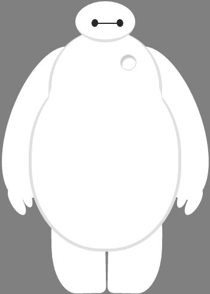

DIV + CSS DEMO
===

## Introduction

* A demo (<strong>Big white animation material</strong>) that only use div + css

* The main labels used are
    
    * tranform: rotate(xx)
    
    * border-radius
    
    * position: relative
    
    * index
    
## Sample

